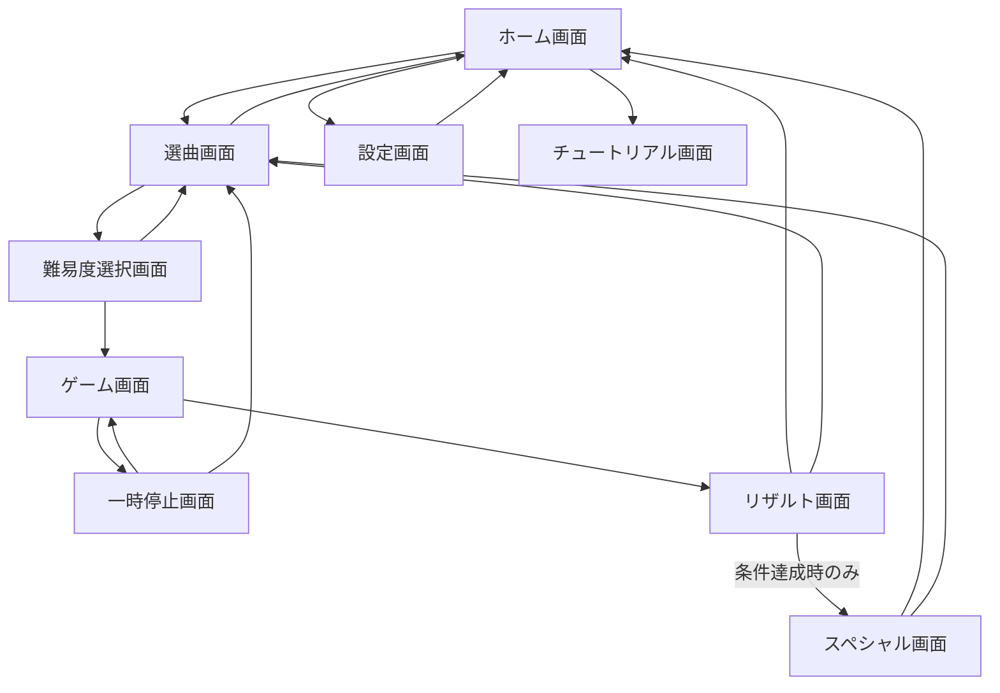

# 和太鼓リズムゲーム 仕様書

## 1. 目的

太鼓の達人風の横スクロール型リズムゲームを想定し、ホーム画面、選曲画面、難易度選択画面、ゲーム画面、リザルト画面、スペシャル画面を持つアプリケーションを定義する。背景写真や楽曲データは差し替えやすい構成にし、リザルト内容に応じて特別演出へ遷移できるようにする。

## 2. 対象プラットフォーム

- 初期版は PC ブラウザまたはデスクトップアプリでの動作を想定する。
- キーボード、ゲームパッド、タッチ操作に対応できる入力抽象化を用意する。
- 画面比率は 16:9 を基準にし、最低解像度は 1280 x 720 とする。

## 3. 画面一覧と役割

| 画面 | 役割 | 主な遷移先 |
| --- | --- | --- |
| ホーム画面 | ゲーム開始、設定、チュートリアルへの入口 | 選曲画面、設定画面、チュートリアル画面 |
| 選曲画面 | 楽曲一覧の表示、楽曲プレビュー再生 | 難易度選択画面、ホーム画面 |
| 難易度選択画面 | 楽曲ごとの難易度、譜面、オプション選択 | ゲーム画面、選曲画面 |
| ゲーム画面 | 譜面再生、判定、スコア計算 | リザルト画面、一時停止画面 |
| リザルト画面 | スコア、コンボ、ランク、解禁条件を表示 | ホーム画面、選曲画面、スペシャル画面 |
| スペシャル画面 | 高評価時の特別演出、称号、画像、ストーリー表示 | ホーム画面、選曲画面 |
| 設定画面 | 音量、キー配置、判定調整、背景差し替え | ホーム画面 |

## 4. 画面遷移



## 5. UI 方針

### 5.1 共通 UI

- 全画面で、写真背景、半透明パネル、大きな丸ボタン、太鼓モチーフの装飾を使用する。
- 重要操作は 1 画面あたり最大 4 個までに抑える。
- 決定、戻る、左右移動、上下移動は入力デバイスに依存しない共通アクションとして扱う。
- 背景写真は画面ごとに設定でき、未設定時はデフォルト背景を使用する。

### 5.2 ホーム画面

- 表示要素
  - ゲームタイトル
  - 「演奏開始」ボタン
  - 「設定」ボタン
  - 「遊び方」ボタン
  - 最新解禁情報またはお知らせ枠
- 操作
  - 「演奏開始」で選曲画面へ遷移する。
  - 「設定」で設定画面へ遷移する。

### 5.3 選曲画面

- 表示要素
  - 楽曲ジャケットまたは背景写真
  - 楽曲名、アーティスト、BPM、再生時間
  - 難易度別クリア状況
  - プレビュー再生状態
- 操作
  - 左右で楽曲を切り替える。
  - 決定で難易度選択画面へ遷移する。
  - 戻るでホーム画面へ遷移する。
- 検索・絞り込み
  - ジャンル、難易度、クリア状況、お気に入りで絞り込み可能にする。

### 5.4 難易度選択画面

- 表示要素
  - かんたん、ふつう、むずかしい、おに、裏譜面などの難易度カード
  - 各難易度の星数、ノーツ数、最高ランク、最高スコア
  - プレイオプション
- プレイオプション
  - ノーツ速度
  - 判定タイミング補正
  - ミラー譜面
  - 練習モード
- 操作
  - 決定で選択中の難易度を開始する。
  - 戻るで選曲画面へ遷移する。

### 5.5 ゲーム画面

- レーンは画面中央から右寄りに配置し、ノーツは右から左へ流れる。
- 判定枠は画面左寄りに固定する。
- ノーツ種別
  - 赤ノーツ: 面入力
  - 青ノーツ: 縁入力
  - 大赤ノーツ: 両面入力または強打扱い
  - 大青ノーツ: 両縁入力または強打扱い
  - 連打ノーツ: 指定時間内の入力数を加点
  - 風船ノーツ: 指定回数入力で成功
- 表示要素
  - スコア
  - コンボ数
  - 魂ゲージ
  - 現在小節または進行バー
  - 判定テキスト（良、可、不可）
- 一時停止
  - 再開、最初から、選曲に戻る、設定を表示する。

### 5.6 リザルト画面

- 表示要素
  - 楽曲名、難易度、スコア、ランク
  - 良、可、不可、連打数、最大コンボ
  - フルコンボ、全良、自己ベスト更新表示
  - 獲得称号、解禁アイテム、スペシャル画面解放表示
- 操作
  - 「ホームへ戻る」でホーム画面へ遷移する。
  - 「選曲へ戻る」で選曲画面へ遷移する。
  - 条件達成時のみ「スペシャルを見る」ボタンを表示する。
- スペシャル画面への遷移条件
  - ランク S 以上
  - フルコンボ達成
  - 全良達成
  - 初回クリア
  - イベント楽曲の指定条件達成
  - 楽曲メタデータで個別指定した条件達成

### 5.7 スペシャル画面

- 表示要素
  - 特別背景写真または動画風演出
  - 称号、メッセージ、解禁キャラクター、記念画像
  - 達成条件の説明
- 操作
  - 「ホームへ戻る」
  - 「選曲へ戻る」
  - 「もう一度見る」
- 演出は楽曲ごと、イベントごと、ランクごとに差し替え可能にする。

## 6. 背景写真の差し替え仕様

### 6.1 ディレクトリ構成

```text
assets/
  backgrounds/
    default/
      home.jpg
      song_select.jpg
      difficulty.jpg
      game.jpg
      result.jpg
      special.jpg
    events/
      summer_festival/
        home.jpg
        song_select.jpg
        result_ss.jpg
  songs/
    song_id/
      jacket.jpg
      background_game.jpg
      background_result.jpg
      special.jpg
```

### 6.2 背景解決順

背景は以下の優先順で読み込む。

1. 楽曲メタデータで指定された背景
2. イベントテーマで指定された背景
3. 画面別デフォルト背景
4. アプリ共通デフォルト背景

### 6.3 設定ファイル例

```json
{
  "theme": "summer_festival",
  "backgrounds": {
    "home": "assets/backgrounds/events/summer_festival/home.jpg",
    "songSelect": "assets/backgrounds/events/summer_festival/song_select.jpg",
    "difficulty": "assets/backgrounds/default/difficulty.jpg",
    "game": "assets/backgrounds/default/game.jpg",
    "result": "assets/backgrounds/default/result.jpg",
    "special": "assets/backgrounds/default/special.jpg"
  }
}
```

## 7. 楽曲データ仕様

### 7.1 楽曲フォルダ

```text
songs/
  matsuri_beat/
    song.json
    audio.ogg
    preview.ogg
    jacket.jpg
    charts/
      easy.json
      normal.json
      hard.json
      oni.json
```

### 7.2 song.json

```json
{
  "id": "matsuri_beat",
  "title": "Matsuri Beat",
  "artist": "Sample Artist",
  "bpm": 160,
  "durationSec": 124,
  "genre": "festival",
  "audio": "audio.ogg",
  "preview": "preview.ogg",
  "jacket": "jacket.jpg",
  "backgrounds": {
    "game": "background_game.jpg",
    "result": "background_result.jpg",
    "special": "special.jpg"
  },
  "specialConditions": [
    { "type": "rankAtLeast", "value": "S" },
    { "type": "fullCombo" }
  ]
}
```

### 7.3 譜面 JSON

```json
{
  "difficulty": "oni",
  "level": 8,
  "offsetMs": 0,
  "notes": [
    { "timeMs": 1000, "type": "don" },
    { "timeMs": 1500, "type": "ka" },
    { "timeMs": 2000, "type": "bigDon" },
    { "timeMs": 2600, "type": "roll", "durationMs": 1200 }
  ]
}
```

## 8. 入力仕様

| アクション | キーボード初期値 | 説明 |
| --- | --- | --- |
| 面入力 | F / J | 赤ノーツ判定 |
| 縁入力 | D / K | 青ノーツ判定 |
| 決定 | Enter / Space | メニュー決定 |
| 戻る | Esc / Backspace | 前画面へ戻る |
| 左右移動 | ← / → | 選曲、選択変更 |
| 上下移動 | ↑ / ↓ | メニュー移動 |
| 一時停止 | Esc | ゲーム中の一時停止 |

## 9. 判定・スコア仕様

### 9.1 判定幅

| 判定 | タイミング差 | 基礎点 |
| --- | --- | --- |
| 良 | ±35 ms | 100% |
| 可 | ±80 ms | 50% |
| 不可 | ±120 ms または未入力 | 0% |

判定幅は設定画面で全体補正できる。難易度別補正は譜面メタデータで指定できる。

### 9.2 ランク

| ランク | 条件 |
| --- | --- |
| SS | 達成率 98% 以上 |
| S | 達成率 92% 以上 |
| A | 達成率 85% 以上 |
| B | 達成率 75% 以上 |
| C | 達成率 60% 以上 |
| D | 達成率 60% 未満 |

### 9.3 リザルト判定フラグ

- `isCleared`: 魂ゲージがクリアライン以上
- `isFullCombo`: 不可が 0
- `isAllPerfect`: 可と不可が 0
- `isNewRecord`: 過去最高スコアを更新
- `canOpenSpecial`: スペシャル条件を満たす

## 10. データ保存仕様

保存データはローカルストレージまたは JSON ファイルで管理する。

```json
{
  "playerName": "Player",
  "settings": {
    "masterVolume": 0.8,
    "musicVolume": 0.8,
    "seVolume": 0.9,
    "inputOffsetMs": 0,
    "noteSpeed": 1.0
  },
  "records": {
    "matsuri_beat": {
      "oni": {
        "bestScore": 980000,
        "bestRank": "S",
        "fullCombo": true,
        "allPerfect": false,
        "specialUnlocked": true
      }
    }
  }
}
```

## 11. 状態管理

アプリ全体の状態は以下のように分ける。

- `AppState`: 現在画面、テーマ、設定、プレイヤー情報
- `SongState`: 選択中楽曲、選択中難易度、フィルター状態
- `PlayState`: 再生時刻、ノーツ状態、スコア、コンボ、ゲージ
- `ResultState`: 判定数、ランク、解禁情報、スペシャル遷移可否

## 12. 最小実装範囲

初期リリースでは以下を必須とする。

1. ホーム画面から選曲、難易度選択、ゲーム、リザルトへ遷移できる。
2. 赤ノーツ、青ノーツを判定できる。
3. スコア、コンボ、ランクを表示できる。
4. 背景写真を設定ファイルまたはファイル差し替えで変更できる。
5. リザルト画面にホームへ戻るボタンを表示できる。
6. 条件達成時のみスペシャル画面ボタンを表示できる。
7. プレイ記録を保存できる。

## 13. 将来拡張

- オンラインランキング
- 譜面エディタ
- イベントテーマ配信
- キャラクター育成
- スキン変更
- コントローラー振動
- アクセシビリティ向け色覚サポート

## 14. 並列作業計画

実装時は、画面ルーティング、共通入力、データスキーマ、背景画像ローダーを先に固定し、その後に UI、ゲームロジック、データ・アセット、QA を並列に進める。詳細な作業単位、担当、依存関係、完了条件、バグ確認項目は [和太鼓リズムゲーム 並列作業分解・検証計画](rhythm_game_work_breakdown.md) に定義する。

## 15. 完了後のバグ確認方針

作業終了時は、仕様・作業分解・README のリンク整合性を確認する。実装フェーズでは、画面遷移、背景フォールバック、判定境界値、スコア集計、リザルトからスペシャル画面への分岐、保存データ復元を重点的に確認し、バグがあれば該当タスクへ戻して修正する。
